# lmm

!SLIDE middle

# Theory and Computational Methods for Linear Mixed Models With given Population Structure

* * * * *


## [Weicheng Zhu](http://dreamhunter.me)

Department of Statistics, Chung Ang University  

Dec 9, 2011

!SLIDE dark middle

# Background

Population Structure

}}} images/family.jpg

!SLIDE dark middle

# What's the model like given the population structure?

!SLIDE middle

# Model written in the paper

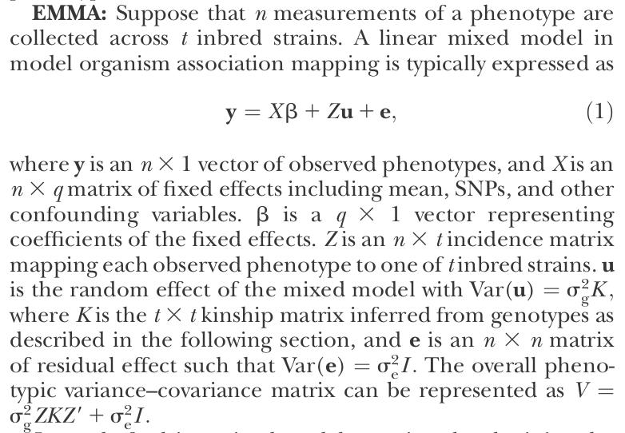


!SLIDE dark middle

# But in my opinion...

!SLIDE dark middle

# As far as I know, no software is available at the moment to estimate this model
<p><font size="10" color="white" >So... </font></p>
<font size="10" color="white" >DIY</font>

}}} images/diy.jpg


!SLIDE bulleted

# Two methods will be shown here

## [Mixed-Effects Models in S and S-PLUS](http://stat.bell-labs.com/project/nlme/MEMSS/index.html) 
by J. C. Pinheiro and D. M. Bates

## Efficient Control of Population Structure in Model Organism Association Mapping
Hyun Min Kang 1,∗, Noah A. Zaitlen 2, etc

!SLIDE dark middle

# Method based on the book

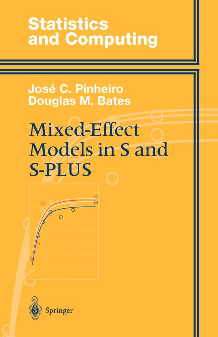

!SLIDE dark middle

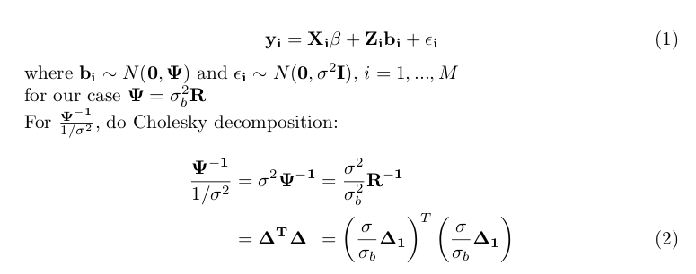

!SLIDE dark middle

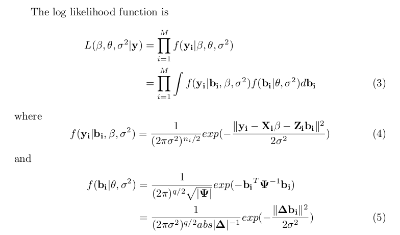

!SLIDE dark middle

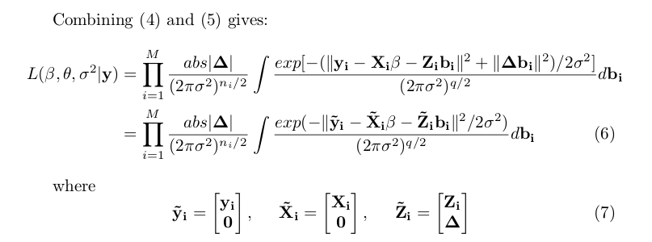

!SLIDE dark middle

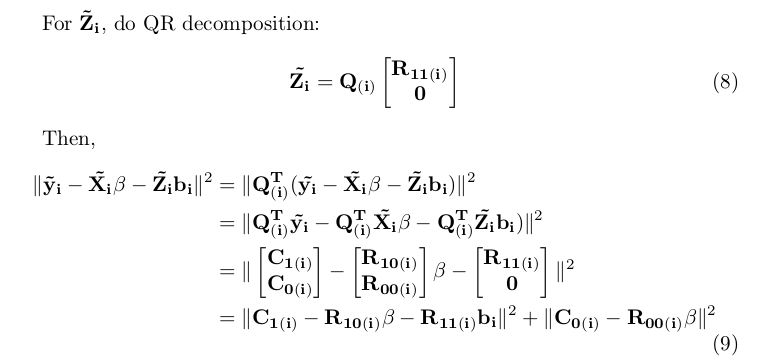

!SLIDE dark middle

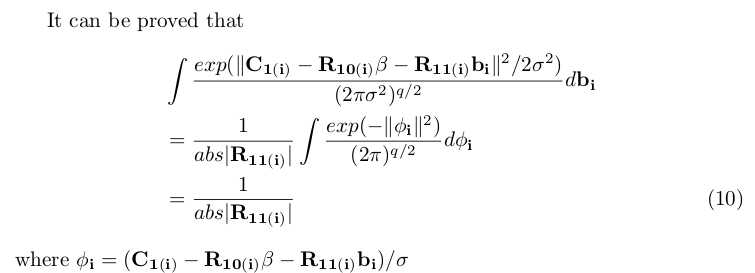

!SLIDE dark middle

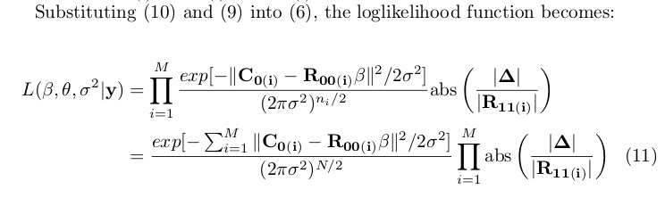

!SLIDE dark middle

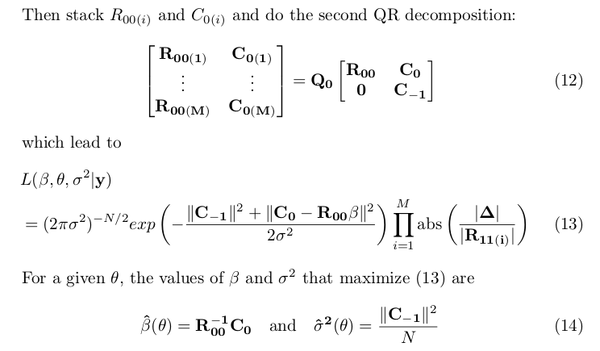

!SLIDE dark middle

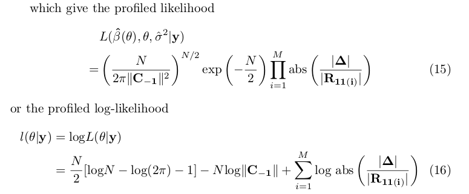

!SLIDE dark middle

# What are you talking about?!

}}}images/shouting.jpg

!SLIDE dark middle

# OK, be easy... In fact the core idea is simple

!SLIDE dark middle

# Reducing dimensions!

!SLIDE dark middle


!SLIDE dark middle


!SLIDE dark middle


!SLIDE dark middle


!SLIDE dark middle


!SLIDE dark middle

So, you see in the profiled log-likelihood function we only have one variable left!

}}}images/exciting.jpeg

!SLIDE dark middle

# Method based on the paper

!SLIDE dark middle

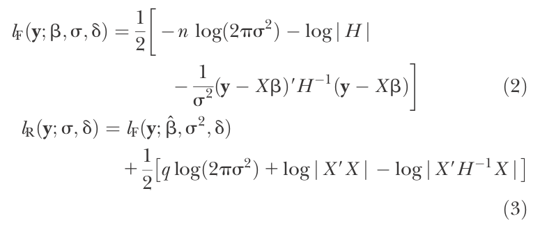

!SLIDE dark middle

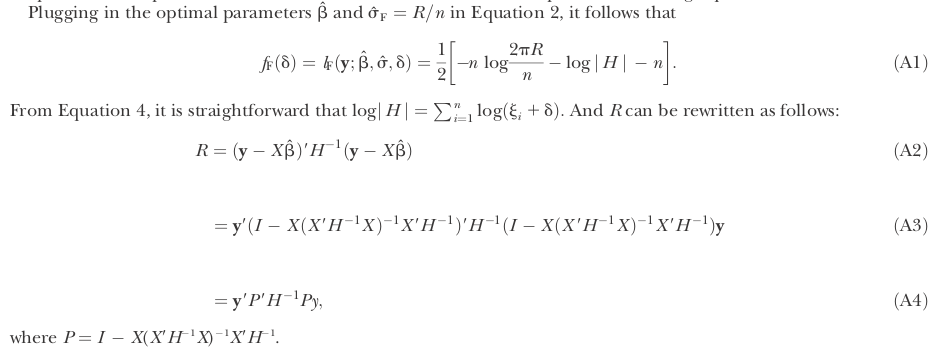

!SLIDE dark middle

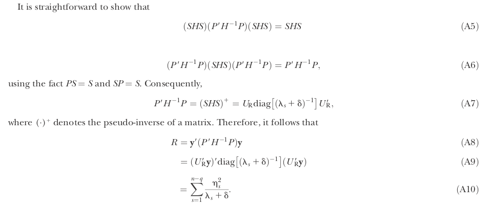

!SLIDE dark middle

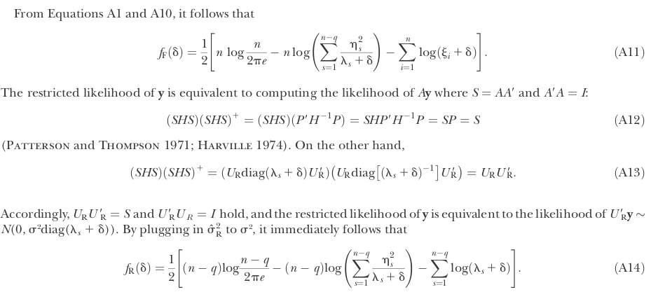

!SLIDE dark middle

<p><font size="10" color="white" >Implementation of the algorithms in R</font></p>

}}}images/terminal.png

!SLIDE 

- lmm: calculate the optimum ratio value (sigma/sigmab) which maximize the log-likelihood function using the algorithm based on the book. Only "ML" method is available at the moment.

- lmm1: the same function with lmm but using the algorithm based on the paper.

!SLIDE middle

# Data generation I

!SLIDE

# Data generation I

```ruby
library(MASS)
M <- 100
beta0 <- 1
K <- cbind(c(1,0,.5,.5),c(0,1,.5,.5),c(.5,.5,1,.5),c(.5,.5,.5,1))
b <- mvrnorm(n=M, rep(0, 4), Sigma=K)
b <- as.vector(t(b))
e <- mvrnorm(n=M, rep(0, 4), Sigma=diag(1,4))
e <- as.vector(t(e))
y <- beta0+b+e
dat <- data.frame(y=y,group=gl(M,4))
> head(dat)
           y group
1  0.3242262     1
2  0.5738888     1
3  4.0762558     1
4 -0.5818391     1
5 -0.2553688     2
6  0.3744547     2
```

!SLIDE

# outcomes and comparison

```ruby

> system.time(
+            lmm.1 <- optimize(lmm,c(0.2,3),dat=dat,K=K,maximum=T)
+             )
   user  system elapsed 
 12.440   0.028  12.488 

> system.time(
+            lmm1.1 <- optimize(lmm1,c(0.2,3),dat=dat,K=K,method="REML",maximum=T)
+             )
   user  system elapsed 
  9.897   0.024   9.935 

> lmm.1
$maximum
[1] 1.083974

$objective
[1] -7004.848

> lmm1.1
$maximum
[1] 0.9336822

$objective
[1] -4417.749
```

!SLIDE

# log-likelihood value plot

```ruby
## plot
lik <- c()
ratio <- seq(0,3,by=0.01)[-1]
for(i in 1:length(ratio))
  lik[i] <- lmm(ratio[i],dat=dat,K=K)
plot(ratio,lik)
ratio[which(lik==max(lik))]
```

!SLIDE middle

}}}images/plot1.png

!SLIDE middle

# Data generation II

!SLIDE 

# Data generation II: when sigmab = 2

```ruby
library(MASS)
M <- 1000
beta0 <- 1
K <- cbind(c(1,0,.5,.5),c(0,1,.5,.5),c(.5,.5,1,.5),c(.5,.5,.5,1))
b <- mvrnorm(n=M, rep(0, 4), Sigma=2*K)
b <- as.vector(t(b))
e <- mvrnorm(n=M, rep(0, 4), Sigma=diag(1,4))
e <- as.vector(t(e))
y <- beta0+b+e
dat <- data.frame(y=y,group=gl(M,4))
```
!SLIDE

# outcomes and comparison

```ruby

> system.time(
+            lmm.1 <- optimize(lmm,c(0.2,3),dat=dat,K=K,maximum=T)
+             )
   user  system elapsed 
 13.504   0.108  13.630 
> system.time(
+            lmm1.1 <- optimize(lmm1,c(0.2,3),dat=dat,K=K,method="REML",maximum=T)
+             )
   user  system elapsed 
  8.333   0.068   8.415 
> lmm.1
$maximum
[1] 0.6656635

$objective
[1] -7636.179

> lmm1.1
$maximum
[1] 0.7188244

$objective
[1] -4777.455

```

!SLIDE middle

# Data generation III


!SLIDE 

# Data generation III: when K is 10 by 10

```ruby
M <- 400
beta0 <- 1
K <- matrix(c(1,0,0,0,.5,0,.25,.25,.25,.25,
              0,1,0,0,.5,0,.25,.25,.25,.25,
              0,0,1,0,0,.5,.25,.25,.25,.25,
              0,0,0,1,0,.5,.25,.25,.25,.25,
              0,0,0,0,1,0,.5,.5,.5,.5,
              0,0,0,0,0,1,.5,.5,.5,.5,
              0,0,0,0,0,0,1,.5,.5,.5,
              0,0,0,0,0,0,0,1,.5,.5,
              0,0,0,0,0,0,0,0,1,.5,
              0,0,0,0,0,0,0,0,0,1
              ),10)
K <- t(K)+K-diag(1,10)
b <-   mvrnorm(n=M, rep(0, 10), Sigma=K)
b <- as.vector(t(b))
e <-   mvrnorm(n=M, rep(0, 10), Sigma=diag(1,10))
e <- as.vector(t(e))
y <- beta0+b+e
dat <- data.frame(y=y,group=gl(M,10))
```

!SLIDE

# outcomes and comparison
```ruby

> system.time(
+            lmm.1 <- optimize(lmm,c(0.2,3),dat=dat,K=K,maximum=T)
+             )
   user  system elapsed 
  4.520   0.000   4.526 
> system.time(
+            lmm1.1 <- optimize(lmm1,c(0.2,3),dat=dat,K=K,method="REML",maximum=T)
+             )
   user  system elapsed 
  3.920   0.000   3.927 
> lmm.1
$maximum
[1] 1.002273

$objective
[1] -6885.292

> lmm1.1
$maximum
[1] 1.123929

$objective
[1] -5824.711
```

!SLIDE middle

# Data generation IV

!SLIDE 

# Data generation IV: when K is 10 by 10 & sigmab = 3

```ruby
M <- 400
beta0 <- 1
K <- matrix(c(1,0,0,0,.5,0,.25,.25,.25,.25,
              0,1,0,0,.5,0,.25,.25,.25,.25,
              0,0,1,0,0,.5,.25,.25,.25,.25,
              0,0,0,1,0,.5,.25,.25,.25,.25,
              0,0,0,0,1,0,.5,.5,.5,.5,
              0,0,0,0,0,1,.5,.5,.5,.5,
              0,0,0,0,0,0,1,.5,.5,.5,
              0,0,0,0,0,0,0,1,.5,.5,
              0,0,0,0,0,0,0,0,1,.5,
              0,0,0,0,0,0,0,0,0,1
              ),10)
K <- t(K)+K-diag(1,10)
b <-   mvrnorm(n=M, rep(0, 10), Sigma=3*K)
b <- as.vector(t(b))
e <-   mvrnorm(n=M, rep(0, 10), Sigma=diag(1,10))
e <- as.vector(t(e))
y <- beta0+b+e
dat <- data.frame(y=y,group=gl(M,10))
## test
optimize(lmm,c(0.2,3),dat=dat,K=K,maximum=T)
# [1] 0.5900726
```
!SLIDE

# outcome and comparison

```ruby
> system.time(
+            lmm.1 <- optimize(lmm,c(0.2,3),dat=dat,K=K,maximum=T)
+             )
   user  system elapsed 
  4.969   0.000   4.975 
> system.time(
+            lmm1.1 <- optimize(lmm1,c(0.2,3),dat=dat,K=K,method="REML",maximum=T)
+             )
   user  system elapsed 
  3.612   0.000   3.617 
> lmm.1
$maximum
[1] 0.5609228

$objective
[1] -8034.179

> lmm1.1
$maximum
[1] 0.5305474

$objective
[1] -6839.043

```
